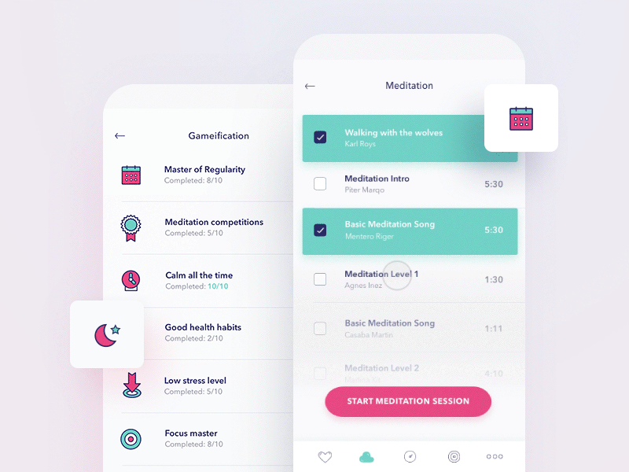
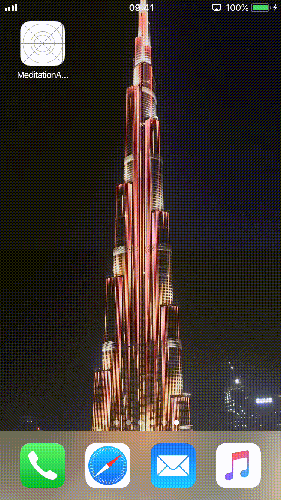

# Meditation app, iOS demo

> Based on [Dribbble shot by Ela Kumela](https://dribbble.com/shots/3853204-Meditation-app?utm_source=Clipboard_Shot&utm_campaign=kumela&utm_content=Meditation%20app&utm_medium=Social_Share), implemented by [Bartłomiej Guminiak](https://github.com/bartguminiak) for [El Passion](https://www.elpassion.com)

|Dribbble shot|Demo app|
|:-:|:-:|
|||

## Setup

Requirements: 

- Xcode 10.1

To set up the project, open terminal in MeditationAppShowcase folder and run `pod install`.

## Run

Open `MeditationAppShowcase.xcworkspace` and run production scheme in a chosen simulator. If you want to run the app on a real device, you need to update code signing configuration first.

## Some implementation details

- There are no external dependencies 🔥
- MVVM design architecture ❤️
- The `Business logic` is fully separated from `View logic`. The business logic is performed in viewModels, child viewModels and helpers, and view logic in viewControllers and it's childs / subviews ⚡️
- All dependencies are being protocol-injected via simple dependency container 👌
- Most of the subviews and it's interesting autolayout constraints are exposed to the interface so the animations can be implemented in decorators ☝️
- The `Observer design pattern` is realized by generic `EventEmitter<T>` [EventEmitter.swift](MeditationAppShowcase/MeditationAppShowcase/Commons/Utilities/Observer/EventEmitter.swift) 🙏
- Playlist is build on `UITableView` for resource optimisation and speed so it can handle thousands of songs with no fear 🚀
- Data on play list is mocked up in [MeditationViewModel+Data.swift](MeditationAppShowcase/MeditationAppShowcase/Screens/Meditation/MeditationViewModel+Data.swift) file 🍺

## License

Copyright © 2019 [EL Passion](https://www.elpassion.com)

License: [GNU GPLv3](LICENSE)

🤠
